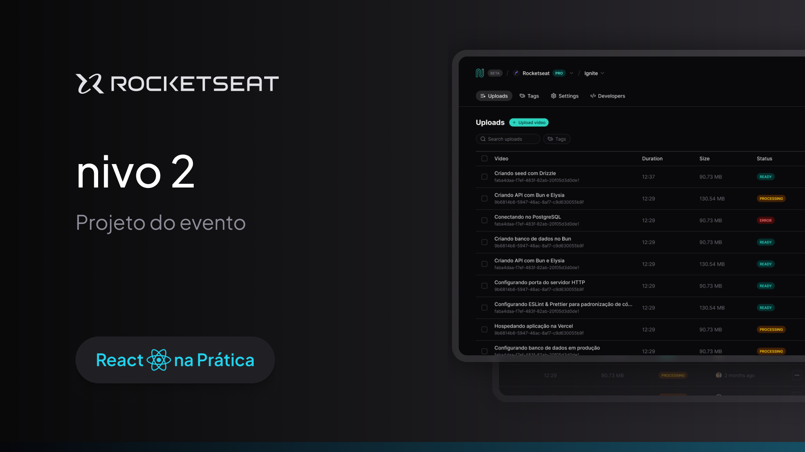

# Data Listing

Data Listing App.


## Technologies Used

The project was developed using the following technologies

- [ReactJS](https://react.dev/)
- [React Router DOM](https://reactrouter.com/en/main) <!-- useSearchParams -->
- [TypeScript](https://www.typescriptlang.org)
- [Tailwindcss](https://tailwindcss.com)
- [Tailwind Variants](https://www.tailwind-variants.org)
- [Tailwind Merge](https://www.npmjs.com/package/tailwind-merge)
- [Radix UI](https://www.radix-ui.com/)
- [Lucide React](https://lucide.dev/)
- [Json Server](https://github.com/typicode/json-server) <!-- updated -->
- [React Query](https://tanstack.com/query/latest)
- [React Hook Form](https://react-hook-form.com/)
- [Zod](https://zod.dev)
- [Eslint](https://eslint.org/)


## Running

After cloning the repository, access the project folder and execute the commands below:

```sh
pnpm install
pnpm dev
```

Access http://localhost:5173 to view the application.
